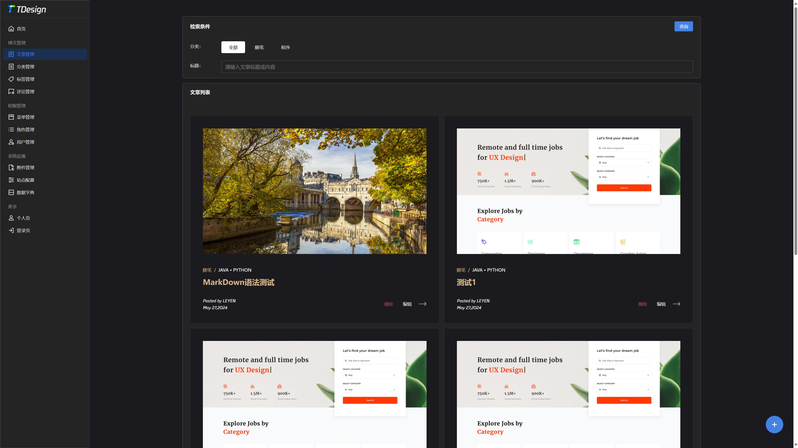
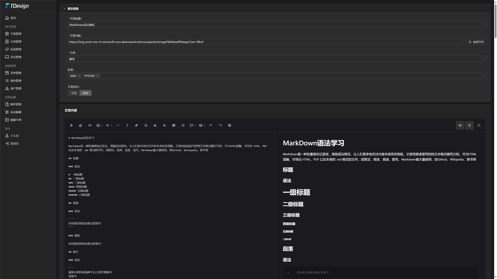

<h1 align="center">OPEN-NUXT-BLOG</h1>

<p align="center">
  <a></a>
  <a></a>
  <a></a>
</p>

# Project Profile

This project is an open source blog system based on Nuxt.js , using Sequelize for database management , the use of TDesign and v-md-editor to achieve interface beautification and Markdown editing functions.

本项目是一个基于 Nuxt.js 的开源博客系统，采用 Sequelize 进行数据库管理，使用 TDesign 和 v-md-editor 实现界面美化和 Markdown 编辑功能。

## Project Screenshot







## Project Features

- 完善的后台管理
- 支持 Markdown 格式的文章编写
- 使用 TDesign 进行界面设计，美观易用
- 基于 Sequelize 进行数据库管理，可靠性高
- 响应式设计，适配各种设备

## Env

```bash
node  v18.19.1+
mysql v5.7+
```

## Development environment running

```bash
# 克隆
git clone https://github.com/difffffft/open-nuxt-blog.git

# 安装依赖
npm i

# 启动服务
npm run dev
```

## Deployment program

- [source_code deploy](./docs/deploy_source_code.md)

- [docker deploy](./docs/deploy_docker.md)

## Contribute

You are welcome to contribute code, ask questions and make suggestions, and you can participate in the project by submitting Pull Requests or Issues.

欢迎贡献代码，提出问题和建议，您可以通过提交 Pull Request 或 Issue 的方式参与到项目中来。

## Thanks

Thank you to all the people who already contributed to Blog!

感谢所有已经为 Blog 做出贡献的人！

<a href="https://github.com/difffffft"></a>
<a href="https://github.com/Beaumon"></a>

## License

[MIT](https://opensource.org/licenses/MIT)

Copyright (c) 2024-present, LeYen
